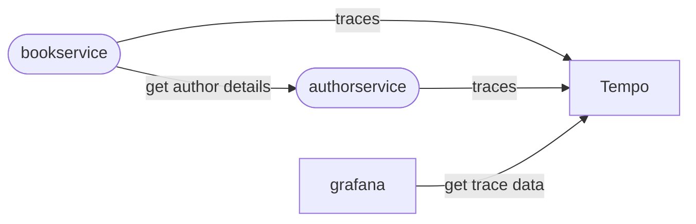

# OTEL Example

## Arichtecture

## Glossary

- **Signals**: `metrics`, `traces` and `logs`
- **Instrumentation**: making a system observable by emitting `traces`, `metrics` and `logs`.
  - **manual**: instrumenting app by including code implementing otel APIs
  - **automatic**: instrumentinf app without changing src code. e.g. using eBPF
  - **instrumentation library**: the library used to instrument our code
  - **instrumented library**: the package (library) that is being instrumented
- **Resource**: Metadata added to Signals (e.g. service name, otel sdk version)
- **Baggage**: contextual information about the current request
- **Context Propagation**: pass baggae from one span to the next
